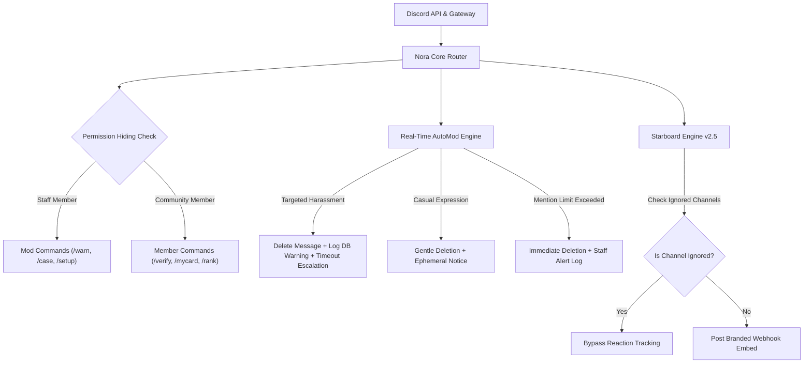

<div align="center">

# ✨ Nora Studio

### **Privacy-First AI & Next-Gen Moderation Ecosystem for Discord**

<p align="center">
  <a href="https://vaztinix.dev"></a>
  <a href="https://top.gg/user/593420060990005248"></a>
  <a href="https://discord.com/users/1214048435632603137"></a>
  <a href="https://github.com/Vaztinix/nora-studio"></a>
  <a href="#-privacy-first-philosophy"></a>
  <a href="https://www.botboard.gg/bots/nora?ref=badge"></a>
  <a href="https://www.botboard.gg/bots/nora?ref=badge"></a>
  <a href="https://www.botboard.gg/bots/nora?ref=badge"></a>
  <a href="https://www.botboard.gg/bots/nora?ref=badge"></a>
</p>


</div>

---

## What is Nora?

**Nora** is a high-performance, privacy-first Discord ecosystem engineered to provide elite community moderation, multi-mode member verification, Roblox identity linking, collaborative chat games, and server telemetry without compromising user privacy.

Nora supports dual command execution: run any feature using native Discord Slash Commands (`/`) or standard chat prefixes (`n!`, `n?`, or `@Nora`).

Unlike legacy Discord bots that hoard user data or spam permissions, Nora operates under a strict **Zero-Access Architecture**:
- **No Permanent Message Storage:** Chat content is processed in volatile memory only for AutoMod, prefix commands, and game checks, then discarded instantly.
- **Zero Developer Backdoors:** Developers have no backend overrides to inspect private chats, server logs, or member statistics.
- **User Sovereignty:** Members can run `/mycard` or `n!mycard` to inspect their data and hit **Erase Data** for an immediate, irreversible wipe.

---

## Key Feature Modules

| Module | Version | Description |
| :--- | :---: | :--- |
| **Multi-Mode Verification** | `v2.6` | 4 Server verification engines: 1-Click Instant Button, Anti-Bot Visual CAPTCHA, Emoji Reactions, and Roblox Account Linking. |
| **Universal Prefix (n!)** | `v2.6` | Full command parity with standard text prefix `n!<command>` (e.g. `n!afk`, `n!rank`, `n!setup`, `n!warn`, `n!story`). |
| **AFK & Availability** | `v2.6` | Status broadcast system, auto `[AFK]` nickname prefixing, anti-ping notifications with auto-cleanup, and return detection. |
| **Community Games** | `v2.5` | Sequential Counting with anti-cheat & XP rewards, plus collaborative One Word Story with milestone archives. |
| **Security & Anti-Raid** | `v2.1` | Velocity join limiters, account age enforcement, avatar requirements, suspicious nickname filtering, and 1-click server lockdown. |
| **Roblox Verification** | `v2.4` | Real-time Roblox identity linking, group rank role bindings, nickname sync, and server access gating. |
| **Starboard System** | `v2.5` | Reaction voting highlights, custom emojis, star count thresholds, branded webhook posts, and **Ignored Channels filter**. |
| **Leveling & Rank Cards** | `v2.3` | Voice & text XP algorithms, role rewards, leaderboards, and custom rank card design studio (custom colors, borders, image uploads). |
| **Support Ticketing** | `v2.5` | Help desk reaction panels, staff routing, automated transcripts, and auto-category archiving. |
| **AI & Autoresponder** | `v2.1` | Dual-AI engine (Local Aura V10 & Gemini/OpenAI), regex autoresponders, and smart intent classifier. |
| **Nora Studio Dashboard** | `v2.6` | Web-based management portal with real-time sync, unsaved changes guards, and server telemetry. |

---

## 🛠️ Core System Architecture




---

## 🚀 Self-Hosting Guide

For detailed documentation, see the full [SELF_HOSTING.md](SELF_HOSTING.md) guide.

### 📋 Prerequisites
- **Node.js** `v18.0.0` or higher ([Node.js Download](https://nodejs.org/))
- **Git** installed on your system
- **Discord Bot Token** from [Discord Developer Portal](https://discord.com/developers/applications)

### 🛠️ Quick Start

```bash
# 1. Clone the repository
git clone https://github.com/Vaztinix/nora-studio.git
cd nora-studio

# 2. Install dependencies
npm install

# 3. Create environment file
cp .env.example .env
```

Open `.env` in a text editor and fill in your Bot Token:
```env
PORT=3000
TOKEN=your_discord_bot_token_here
API_BASE_URL=http://localhost:3000
```

#### 4. Privileged Gateway Intents
In the [Discord Developer Portal](https://discord.com/developers/applications), select your bot, go to **Bot** -> **Privileged Gateway Intents**, and turn ON:
- [x] **Server Members Intent** (`GUILD_MEMBERS`)
- [x] **Presence Intent** (`GUILD_PRESENCES`)
- [x] **Message Content Intent** (`MESSAGE_CONTENT`)

#### 5. Build and Launch
```bash
# Build production web dashboard assets
npm run build

# Start Nora Bot & Dashboard
npm start
```
Once initialized, access your local dashboard at `http://localhost:3000`.

#### 6. 24/7 Production Hosting with PM2
```bash
npm install -g pm2
pm2 start src/index.js --name "nora-studio"
pm2 save
pm2 startup
```

---

## Privacy-First Philosophy

Nora is built around complete user sovereignty. Server administrators and individual members maintain total control over their data:

```
┌─────────────────────────────────────────────────────────┐
│                    NORA LIMITED ACCESSS DATA            │
├─────────────────────────────────────────────────────────┤
│ • Guild Settings : Stored securely per server ID        │
│ • Level & XP     : Isolated to local guild context      │
│ • Roblox Link    : Hashed ID association                │
│ • Message Content: NEVER stored on disk                 │
│ • User Control   : /mycard ➜ Instant "Erase Data" Wipe │
└─────────────────────────────────────────────────────────┘
```

---

## Developer & Official Links

<div align="center">

### **Created with passion by Vaztinix**

| Platform | Direct Link |
| :--- | :--- |
| **Archived Website** | [vaztinix.github.io/Nora](https://vaztinix.github.io/Nora) |
| **Official Website** | [vaztinix.dev](https://vaztinix.dev) |
| **Developer Profile** | [vaztinix.dev/me](https://vaztinix.dev/me) |
| **Top.gg Profile** | [top.gg/user/593420060990005248](https://top.gg/user/593420060990005248) |
| **GitHub Repository** | [github.com/Vaztinix/nora-studio](https://github.com/Vaztinix/nora-studio) |
| **Discord Profile** | [discord.com/users/1214048435632603137](https://discord.com/users/1214048435632603137) |
| **Contact me** | [vaztinixstudios@gmail.com](mailto:vaztinixstudios@gmail.com) |

<br>

*Built with curiosity, precision, and a belief that privacy should always be the default.*

</div>
